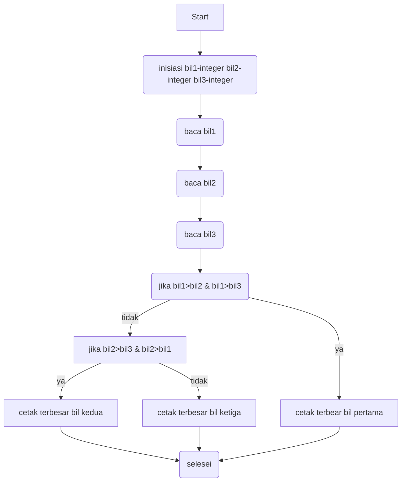

# Menentukan bilangan terbesar dari 3 bilangan
## Algoritma
1.  Mulai
2.  Inisiasi bil1,bil2,bil3 sebagai integer.
3.  Baca bil1.
4.  Baca bil2.
5.  Baca bil3.
6.  Jika bil1 > bil2 dan bil1 > bil3 maka kerjakan langkah 8, selain itu
7.  Jika bil2 > bil1 dan bil2 > bil3 maka kerjakan langkah 9, selain itu kerjakan langkah 10.
8.  Cetak “Bilangan Terbesar Bilangan Pertama”.
9.  Cetak “Bilangan Terbesar Bilangan Kedua”.
10.  Cetak “Bilangan Terbesar Bilangan Ketiga”.
11.  Selesai

## Flow chart:

## Program

### Hasil program

